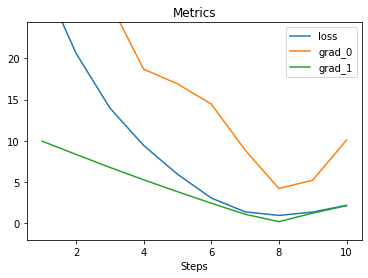
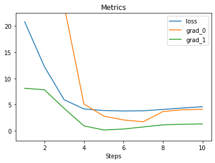

```
python3 projectOK/main.py
```
```

# Testing reconstruction methods on
high-dimensional Gaussian Mixtures

Training Checkpoint restored: /content/Thesis/models/net_GMM_2-4-4-4-3.pt
net accuracy: 72.3%

## Method: NN feature
Beginning Inversion.


/usr/local/lib/python3.6/dist-packages/scipy/stats/_multivariate.py:660: RuntimeWarning: covariance is not positive-semidefinite.
  out = random_state.multivariate_normal(mean, cov, size)


HBox(children=(FloatProgress(value=0.0, description='Step', max=10.0, style=ProgressStyle(description_width='i…


Results:
	loss: 3.074
	l2 reconstruction error: 2.390
	cross entropy of B: inf
	nn accuracy: 49.0 %

## Method: NN feature CC
Beginning Inversion.


HBox(children=(FloatProgress(value=0.0, description='Step', max=10.0, style=ProgressStyle(description_width='i…


Results:
	loss: 4.785
	l2 reconstruction error: 3.405
	cross entropy of B: inf
	nn accuracy: 24.3 %

## Method: RP
Beginning Inversion.


HBox(children=(FloatProgress(value=0.0, description='Step', max=10.0, style=ProgressStyle(description_width='i…





Results:
	loss: 3.074
	l2 reconstruction error: 2.390
	cross entropy of B: inf
	nn accuracy: 49.0 %

## Method: RP CC
Beginning Inversion.


HBox(children=(FloatProgress(value=0.0, description='Step', max=10.0, style=ProgressStyle(description_width='i…





Results:
	loss: 4.785
	l2 reconstruction error: 3.405
	cross entropy of B: inf
	nn accuracy: 24.3 %

Summary
=======

Data A
cross entropy: 2.494
nn accuracy: 72.3 %

perturbed Data B
cross entropy: inf
nn accuracy: 19.0 %

method         loss  l2 err  accuracy  cross-entropy  
------------------------------------------------------
NN feature     3.07  2.39    0.49      inf            
NN feature CC  4.78  3.41    0.24      inf            
RP             3.07  2.39    0.49      inf            
RP CC          4.78  3.41    0.24      inf            

